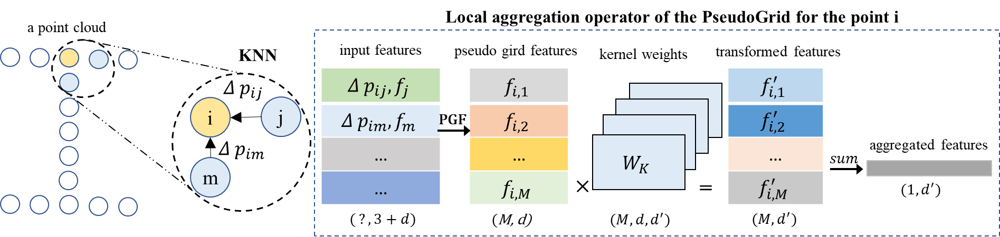
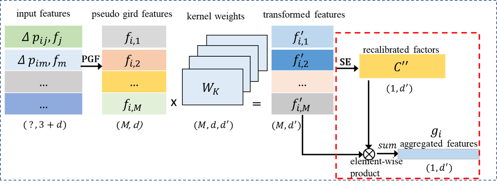
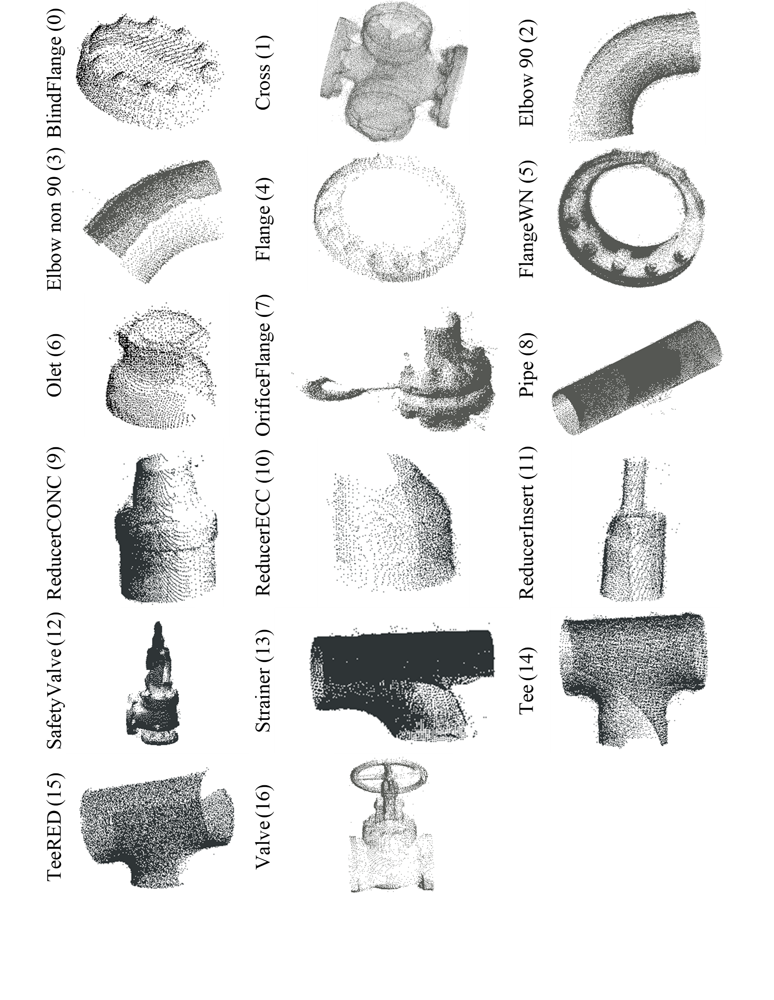
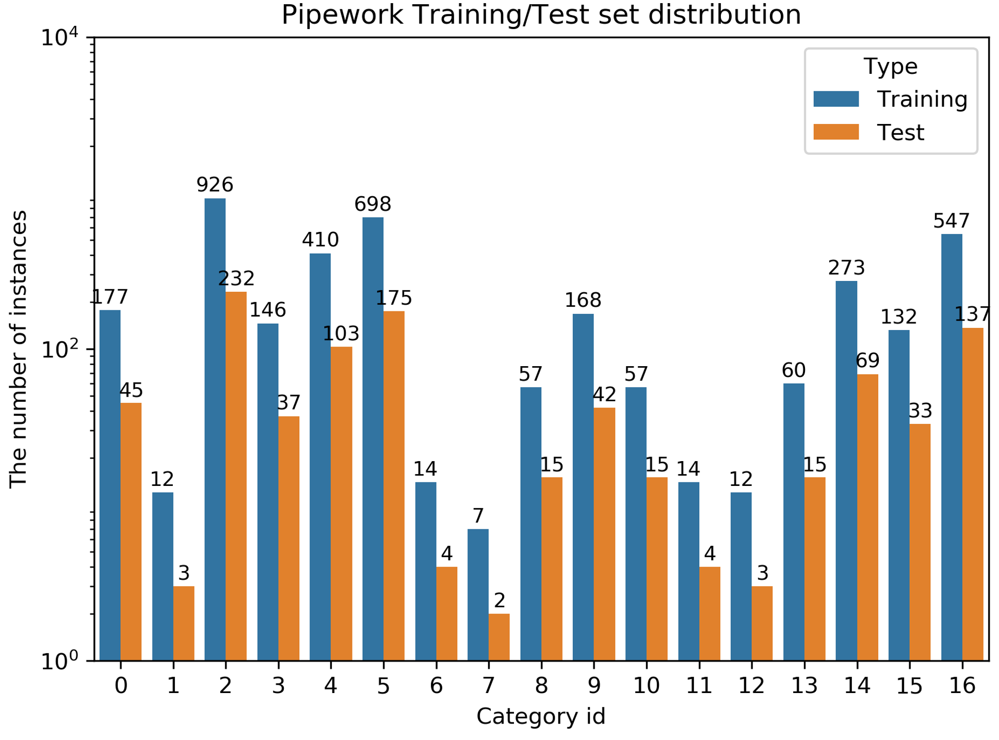

# Classification of Piping Components

This repository is an official implementation of our new paper [Automated Classification of Piping Components from 3D LiDAR Point Clouds using SE-PseudoGrid](https://www.sciencedirect.com/science/article/pii/S092658052200173X), published in the [Automation in Construction](https://www.sciencedirect.com/journal/automation-in-construction) journal. (For free access, you may also read our paper in the [ResearchGate](https://www.researchgate.net/publication/360393009_Automated_classification_of_piping_components_from_3D_LiDAR_point_clouds_using_SE-PseudoGrid).)

In this study, we proposed **a novel local aggregation operator(LAO) based the squeeze-and-excite mechanism from the popular SENet in 2D image analysis (termed SE-LAO) for point cloud feature learning**. On top of the newly proposed SE-LAO and the strong PseudoGrid, we construct a new network for piping component classification (named SE-PseudoGrid). 
To the best of our knowledge, it is the first attempt to generalize the squeeze-and-excite mechanism for 2D image analysis to 3D point cloud analysis. With this new design in the local aggreation operators for point clouds, our SE-PseudoGrid outpeforms the strong baseline PseudoGrid by a large margin on the piping benchmark datast(Pipework).

- the original LAO in the PseudoGrid (reproduced based on the [CloserLook3D paper](https://arxiv.org/abs/2007.01294))


- our novel SE-LAO based on the LAO (in PseudoGrid) and squeeze-and-excite mechanism


## Requirements

To install requirements:

```setup
#!/bin/bash
ENV_NAME='se'
conda create –n $ENV_NAME python=3.6.10 -y
source activate $ENV_NAME
conda install -c anaconda pillow=6.2 -y
conda install pytorch==1.4.0 torchvision==0.5.0 cudatoolkit=10.1 -c pytorch -y
conda install -c conda-forge opencv -y
pip3 install termcolor tensorboard h5py easydict
```

Note that: the latest codes are tested on two Ubuntu settings: 
- Ubuntu 18.04, Nvidia 3090, CUDA 11.3, PyTorch 1.4 and Python 3.6

### Compile custom CUDA operators

```bash
sh init.sh
```

## Pipework dataset

We select the sole piping dataset i.e., Pipework (shown below) as the benchmark and canonicalize it following ModelNet40' pratice. The canonicalized dataset can be downloaded from [Pipework dataset](https://hkustconnect-my.sharepoint.com/:u:/g/personal/cyinac_connect_ust_hk/ETc4J03wD0FFidQW4OnQUnUB0fX4m1BqkPhsYZy5W9Lz_w?e=lT3k6Q). Note that the detailed preprocessing steps are shown in the [pipework-prepare-v2.ipynb](pipework-prepare-v2.ipynb).



typical instances for the 17 categories in the Pipework


train and test set distribution of the new Pipework dataset

```
# download the pipework dataset
unzip pipework-new.zip
cd pipework-new
# move the pipe-original to the root/data folder
# or symlink to the root/data folder
```

The file structure should look like:

```
<root>
├── cfgs
│   └── s3dis
├── data
│   └── Pipework
│       └── PipeWork-original
│           ├── BlindFlange
│           ├── Cross
│           └── ...
├── init.sh
├── datasets
├── function
├── models
├── ops
└── utils
```

## Training

To train the model(s) in the paper, run this command:

```train
python -m torch.distributed.launch \
--master_port ${port_number} \ # 12346
--nproc_per_node ${NUM_GPUs} \ # e.g., 1
function/train_pipework_dist.py \
--cfg cfgs/pipework/${yaml_file} \ # e.g., cfgs/pipework/xxx.yaml
--num_points ${num_points} \
--val_freq 10 \
--save_freq 50 \
--loss ${LOSS} \ # e.g., smooth
--use_avg_max_pool ${use_avg_max_pool}  # e.g., true  
```

## Evaluation

To evaluate my model on ImageNet, run:

```eval
python -m torch.distributed.launch \
--master_port ${port_number} \ # 12346
--nproc_per_node ${NUM_GPUs} \
--local_rank 1 \
function/evaluate_pipework_dist.py \
--load_path ${checkpoint_path} \ # e.g., log/pipework/xxx/best.pth 
--cfg ${cfg_path} \ # e.g., cfgs/pipework/xxx.yaml
--data_aug ${data_aug} \ # e.g., true or false
--loss ${LOSS} \ # e.g., smooth
--use_avg_max_pool ${use_avg_max_pool}  # e.g., true  
```

## Pre-trained Models

You can download pretrained models here:

- [TOADD](https://drive.google.com/mymodel.pth) trained on the Pipework


## Results

- We benchmark six shortlisted representatative DL-based methods on the Pipework.
- On top of our newly proposed SE-LAO and the strong baseline PseduoGrid, we construct our SE-PseudoGrid; It achieves better performance than the baseline, decreasing OA and avgAcc error rate of the backbone by 25.4%, 34.5%, respectively.


|Network | 	OA (%) |avgAcc (%) |
|--------|---------|-----------|
|PointNet |	84.15 |	73.95 |
|PointNet++|	86.87|	75.30 |
|DGCNN |	90.90|	77.16 |
|PointCNN |	91.05 |	88.68 |
|PosPool | 	94.33 |	93.61 |
|PseudoGrid |	94.97 |	96.24 |
|**SE-PseudoGrid (ours)** |	**96.25** | **97.54**|


## Acknowledgements

Our pytorch codes borrowed a lot from [CloserLook3D](https://github.com/zeliu98/CloserLook3D/tree/master/pytorch) and the custom trilinear interoplation CUDA ops are modified from [erikwijmans's Pointnet2_PyTorch](https://github.com/erikwijmans/Pointnet2_PyTorch).

Besides, thanks [Prof. Duhwan Mun](https://www.dhmun.net/) group to provide the open [PipeWork](https://www.dhmun.net/home/Research_Data) dataset.

## Contributing

MIT license

## Citation

If you find our work useful in your research, please consider citing:

```
@article{se-pseudogrid,
    Author = {Chao Yin, Jack CP Cheng*, Boyu Wang, Vincent JL Gan*},
    Title = {Automated Classification of Piping Components from 3D LiDAR Point Clouds using SE-PseudoGrid},
    Journal = {Automation in Construction},
    Year = {2022}
   }
```
