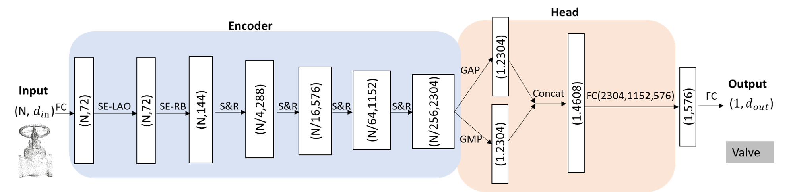

# Classification of Piping Components

**Coming soon!** 

This repository is the official implementation of **Automated Classification of Piping Components from 3D LiDAR Point Clouds using SE-PseudoGrid**, [link (to be added)](xxx). 

We proposed a new local aggregation operator termed SE-LAO for point cloud feature learning through introducing the squeeze-excite (SE) mechanism from SENet into the pseudo grid LAO.

- the conventional PseudoGrid LAO


- our proposed SE-LAO


## Pipework dataset

As the sole publicly open dataset for piping components, we canonicalize it following ModelNet40' pratice.

- typical instances for the 17 categories in the Pipework


- class distribution 


- train and test set distribution


## Requirements

To install requirements:

```setup
pip install -r requirements.txt
```

>📋  Describe how to set up the environment, e.g. pip/conda/docker commands, download datasets, etc...

## Training

To train the model(s) in the paper, run this command:

```train
python train.py --input-data <path_to_data> --alpha 10 --beta 20
```

>📋  Describe how to train the models, with example commands on how to train the models in your paper, including the full training procedure and appropriate hyperparameters.

## Evaluation

To evaluate my model on ImageNet, run:

```eval
python eval.py --model-file mymodel.pth --benchmark imagenet
```

>📋  Describe how to evaluate the trained models on benchmarks reported in the paper, give commands that produce the results (section below).

## Pre-trained Models

You can download pretrained models here:

- [My awesome model](https://drive.google.com/mymodel.pth) trained on ImageNet using parameters x,y,z. 

>📋  Give a link to where/how the pretrained models can be downloaded and how they were trained (if applicable).  Alternatively you can have an additional column in your results table with a link to the models.

## Results

- We benchmark six shortlisted representatative DL-based methods on the Pipework.
- On top of our newly proposed SE-LAO and the strong baseline PseduoGrid, we construct our SE-PseudoGrid; It achieves better performance than the baseline, decreasing OA and avgAcc error rate of the backbone by 25.4%, 34.5%, respectively.



|Network | 	OA (%) |avgAcc (%) |
|--------|---------|-----------|
|PointNet |	84.15 |	73.95 |
|PointNet++|	86.87|	75.30 |
|DGCNN |	90.90|	77.16 |
|PointCNN |	91.05 |	88.68 |
|PosPool | 	94.33 |	93.61 |
|PseudoGrid |	94.97 |	96.24 |
|**SE-PseudoGrid (ours)** |	**96.25** | **97.54**|


>📋  Include a table of results from your paper, and link back to the leaderboard for clarity and context. If your main result is a figure, include that figure and link to the command or notebook to reproduce it. 


## Contributing

>📋  Pick a licence and describe how to contribute to your code repository. 

